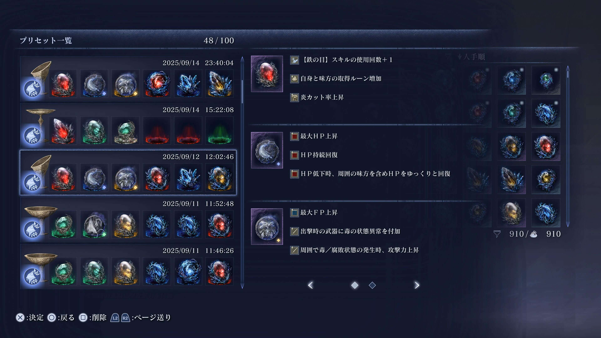
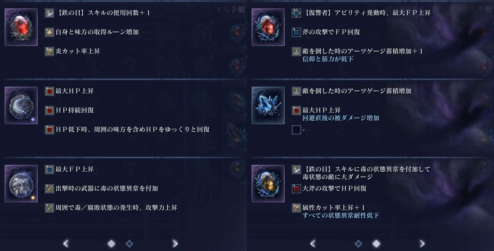

# enr-relics-merger

ELDEN RING NIGHTREIGN の遺物効果1〜3の画像、4〜6の画像を結合して1枚の画像に結合するツール。

21:9 など左右に黒帯が付いたスクリーンショットでも、中央の 16:9 領域を自動検出して結合できるようになりました。

https://17number.github.io/enr-relics-merger/

## サンプル

### パターン1(遺物儀式画面)

#### 入力画像(遺物儀式画面)

 

#### 出力画像(遺物儀式画面)

### パターン2(ステータス画面)

#### 入力画像(ステータス画面)

 

#### 出力画像(ステータス画面)

### パターン3(プリセット画面)

#### 入力画像(プリセット画面)

 

#### 出力画像(プリセット画面)

## 要望など

なにかあれば [Issues](https://github.com/17number/enr-relics-merger/issues/new) からご連絡ください。可能な範囲で対応します。

すでに [類似の Issue が無いかを事前確認](https://github.com/17number/enr-relics-merger/issues?q=is%3Aissue) したうえでご連絡頂けると助かります。
